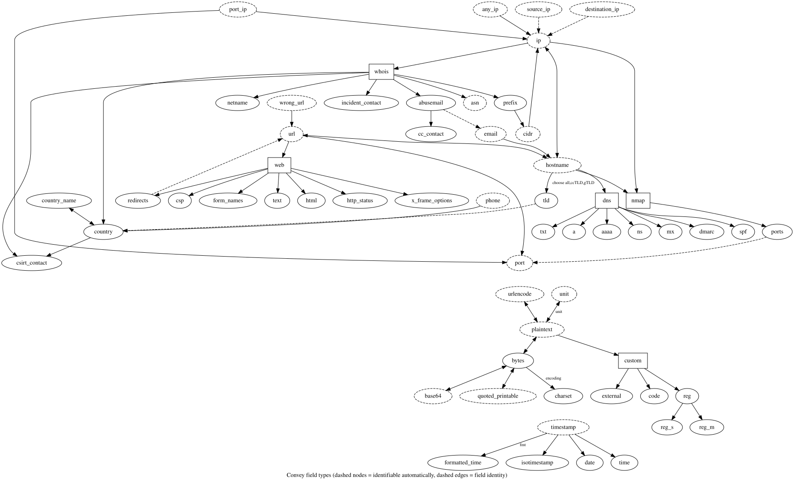

# Computing fields

## Computable fields

Some field types are directly computable:

* **abusemail** – got abuse e-mail contact from whois
* **asn** – got from whois
* **base64** – encode/decode
* **cc_contact** – e-mail address corresponding with the abusemail, taken from your personal contacts_cc CSV in the format `domain,cc;cc` (mails delimited by a semicolon). Path to this file has to be specified in `config.ini » contacts_cc`.
* **country** – country code from whois
* **~~csirt_contact~~** – e-mail address corresponding with country code, taken from your personal contacts_abroad CSV in the format `country,abusemail`. Path to this file has to be specified in `config.ini » contacts_abroad`
* **external** – you specify method in a custom .py file that receives the field and generates the value for you, see below
* **hostname** – domain from url
* **incident_contact** – if the IP comes from local country (specified in `config.ini » local_country`) the field gets *abusemail*, otherwise we get *country@@mail* where *mail* is either *abusemail* or abroad country e-mail. When splitting by this field, convey is subsequently able to send the split files to local abuse and foreign csirt contacts.
* **ip** – translated from url
* **netname** – got from whois
* **prefix** – got from whois

### Whois module

When obtaining a WHOIS record

* We ask **RDAP** first – the JSON successor of the port 43 *whois* protocol. gTLD registries are allowed to shut *whois* down (ICANN Registration Data Policy, since 2025-01-28) and the RIRs are heading the same way. Should RDAP not answer (most ccTLDs, ex: `.cz`, have no RDAP) or should the answer be incomplete, we fall back to *whois*. Choose the backend with `--whois.backend auto|rdap|whois`.
* RDAP does not carry the announcing **ASN** (*whois* has it in the `origin:` route object), hence we resolve it over DNS from the Cymru IP-to-ASN zone (needs `dig`; disable with `--whois.asn-lookup False`).
* We are internally calling `whois` program, detecting what servers were asked.
* Sometimes you encounter a funny formatted *whois* response. We try to mitigate such cases and **re-ask another registry** in well known cases.
* Since IP addresses in the same prefix share the same information we cache it to gain **maximal speed** while reducing *whois* queries.
* Sometimes you encounter an IP that gives no information but asserts its prefix includes a large portion of the address space. All IP addresses in that portion ends labeled as unknowns. At the end of the processing you are **asked to redo unknowns** one by one to complete missing information, flushing misleading superset from the cache.
* You may easily hit **LACNIC query rate** quota. In that case, we re-queue such lines to be queried after the quota is over if possible. At the end of the processing, you will get asked whether you wish to carefully and slowly reprocess the lines awaiting the quota lift.

## Detectable fields

Some of the field types are possible to be auto-detected:

* **ip** – standard IPv4 / IPv6 addresses
* **cidr** – CIDR notation, ex: 127.0.0.1/32
* **port_ip** – IPv4 in the form 1.2.3.4.port
* **any_ip** – IPv4 garbled in the form `any text 1.2.3.4 any text`
* **hostname** – or FQDN; 2nd or 3rd domain name
* **url** – URL starting with http/https
* **asn** – AS Number
* **base64** – text encoded with base64
* **wrong_url** – URL that has been deactivated by replacing certain chars, ex: "hxxp://example[.]com"

## Overview of all methods

Current field computing capacity can be get from `--show-uml` flag. Generate yours by ex: `convey --show-uml | dot -Tsvg -o /tmp/convey-methods.svg`

* Dashed node: field type is auto-detectable
* Dashed edge: field types are identical
* Edge label: generating options asked at runtime
* Rectangle: field category border

